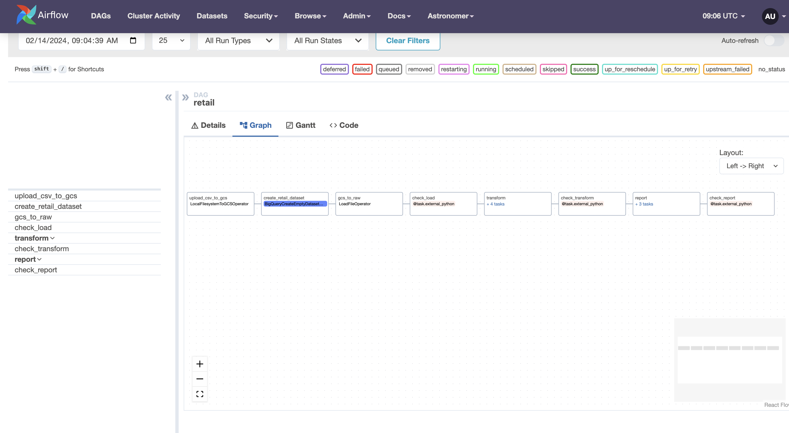
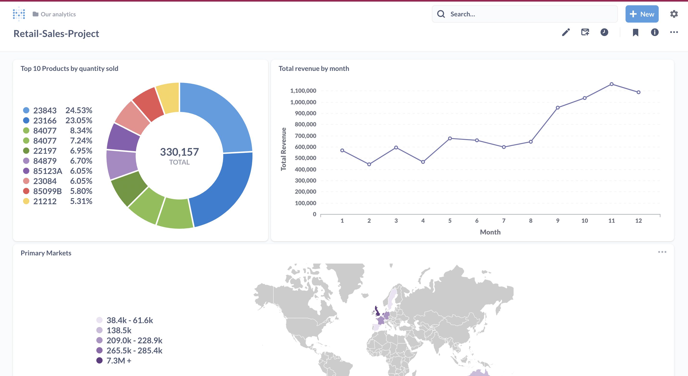

# RetailSalesProject
Airflow data pipeline to analyze retail sales data

## Problem Statement
To perform analysis and visualization on Retail Sales Data.

## Data Source
This is a transnational data set which contains all the transactions occurring between 01/12/2010 and 09/12/2011 for a UK-based and registered non-store online retail.The company mainly sells unique all-occasion gifts. Many customers of the company are wholesalers.

#### Atrribute information:

*InvoiceNo: Invoice number. Nominal, a 6-digit integral number uniquely assigned to each transaction. If this code starts with letter 'c', it indicates a cancellation.

*StockCode: Product (item) code. Nominal, a 5-digit integral number uniquely assigned to each distinct product.

*Description: Product (item) name. Nominal.

*Quantity: The quantities of each product (item) per transaction. Numeric.

*InvoiceDate: Invice Date and time. Numeric, the day and time when each transaction was generated.

*UnitPrice: Unit price. Numeric, Product price per unit in sterling.

*CustomerID: Customer number. Nominal, a 5-digit integral number uniquely assigned to each customer.

*Country: Country name. Nominal, the name of the country where each customer resides.

# Data Model

Data Model following star schema (Fact table and denormalized dimension table)

## Data Pipeline

The dataset online retail downloaded from kaggle is uploaded to a Google Cloud Storage bucket. The raw data is ingested from the GCS bucket to Google BigQuery.Data quality checks are then performed on the raw data using Soda.
After this Dbt is used to model the data to create the fact and dimension tables framework. After applying data quality checks to transformed data, aggregations are applied to transformed data to analyze revenue,primary markets and product sales, creating a Dashboard using Metabase for the same.

Local Airflow instance is run using the Astro Cli and Dbt is integrated with Airflow using Cosmos.

## Final Dashboard

## Technologies Used:
- Airflow
- BigQuery
- Soda
- Dbt
- Python
- SQL